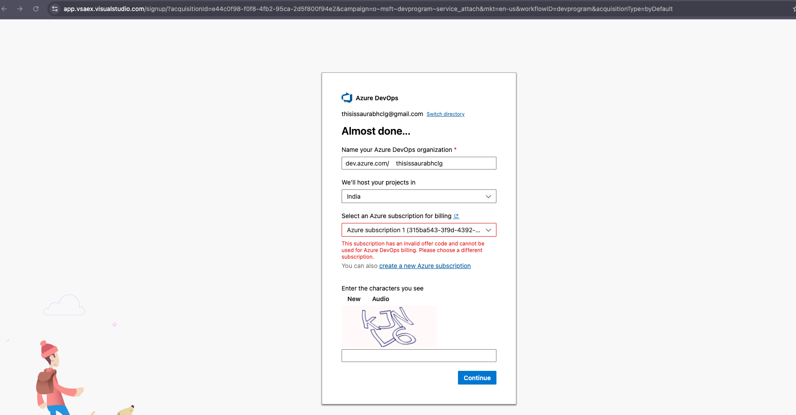
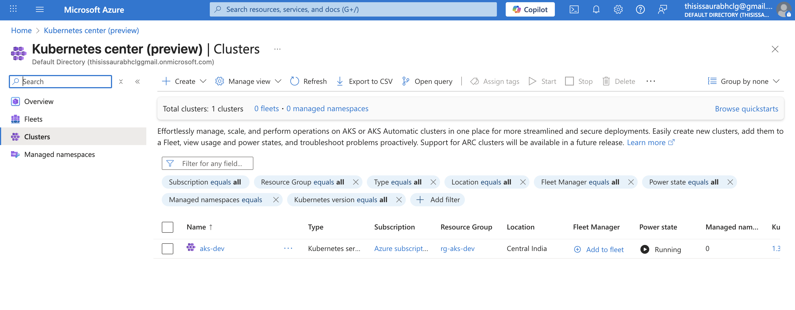
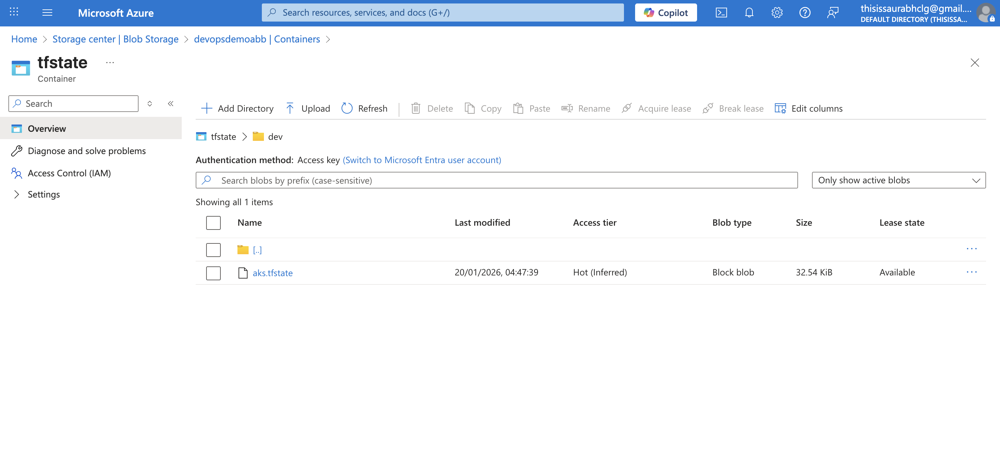
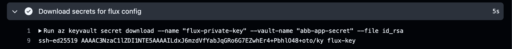
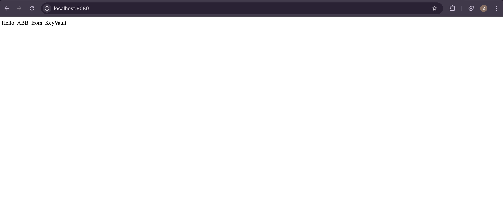
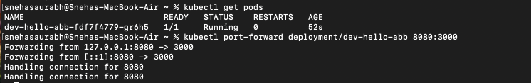
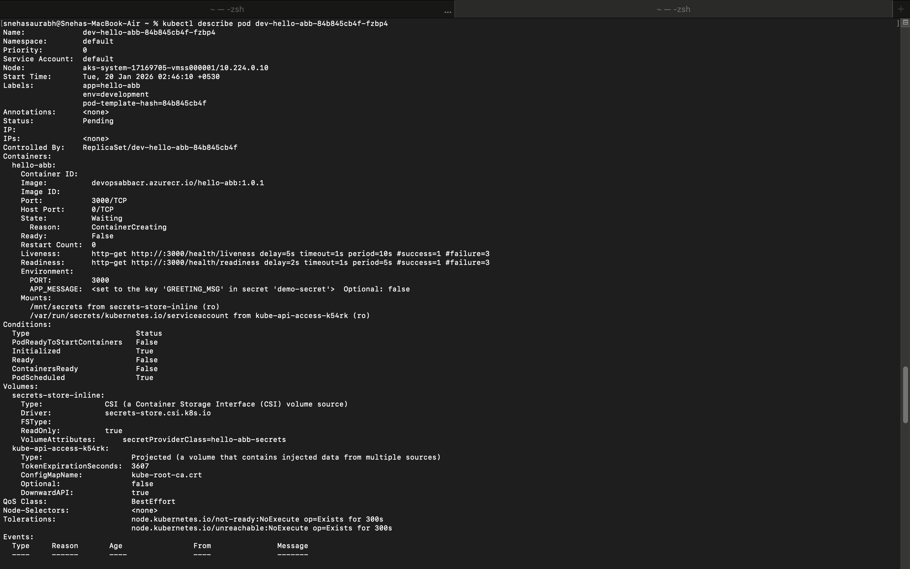
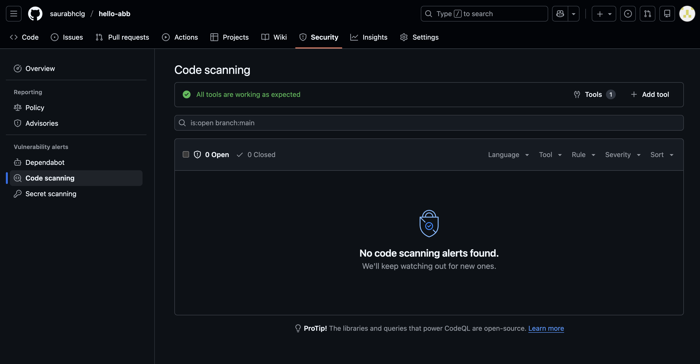

# Hello ABB

I hope you guys are doing well, So finally get ready to see almost all the task whcih was provided as questionaries to me. So lets jumm to one by one topic quickly

Since I was getting some error with my Azure subscription so, I have created the pipeline using GitHub Actions workflow, please find the error message below:
## Error screenshot

The following image shows the subscription error observed during deployment:

# Branching Strategies

- Please reffer [branching-strategy](branching-strategy.md) file.

# CI and CD pipelines

- Build, Test and Deploy logs for "main_hello-abb.yml" can be found here: https://github.com/saurabhclg/hello-abb/actions/runs/21134101870

- BUILD, Test and Deploy logds for Containerize workflow: [CI_CD_pipeline/containerize_hello-abb.yml](./CI_CD_pipeline/containerize_hello-abb.yml) , can be found here : https://github.com/saurabhclg/hello-abb/actions/runs/21150379981

# Multi-staged pipelines | Terraform AKS deployment | Approval gates for production | Secret management 

These all task are acheived by this repo: https://github.com/saurabhclg/terraform-aks-demo

- Multi staged pipeline yaml and environment specific parameter can be found here: [multi-staged-pipeline/aks-tf-deployment.yml](./multi-staged-pipeline/aks-tf-deployment.yml)

### What we do with this multi-staged-pipeline ?

- We are creating AKS cluster whcih via terraform and deploy two different environemnts/clusters.
- As a input we need to specifiy what want to deploy and wait for the magic.
- In case of DEV deployment it runs without any manual approval but in case of PROD manual approval is required.

### Terraform AKS Deployment
- 
- State file can be found here [tf-state](terraform-aks-deployment/aks.tfstate)
- storage accrount overview: 
- You can refer to the [main.tf](terraform-aks-deployment/modules/aks/main.tf)
- tf files can be found here: https://github.com/saurabhclg/terraform-aks-demo/tree/main/modules/aks
- Output logs can be found here: https://github.com/saurabhclg/terraform-aks-demo/actions/runs/21153842107/job/60835367416 

### ACR : Azure Container Registry

### Approval gates for prodcurion 

- check for yaml file :  [approval gate](approval-gate/aks-tf-deployment.yml)

### What we have done fo secret management ?
- 
- [Secret management workflow file](secret-management/aks-tf-deployment.yml)
- You can the last step of multi-staged pipeline : [multi-staged-pipeline/aks-tf-deployment.yml](./multi-staged-pipeline/aks-tf-deployment.yml)
- Here you can find the screenshot of that 
- additionally you can find the details in logs also : https://github.com/saurabhclg/terraform-aks-demo/actions/runs/21153842107/job/60835367416

# Dockerized application
- Dockerfile can be found here [Dockerfile](./dockerized-applications/Dockerfile)
- build and push log can be found here: [build_push.logs](./dockerized-applications/dockerbuild_push.log)
### Aplication out after port-forwarding:

# Kubernetes Deployment
- Applications are deployed using github actions worflow.
- All applications are deplyed via deployment files.
- You can find all the deployment files here: [All Deployment files](./kubernetes-deployment/deployment_files)
- You can find the more detils in repo: https://github.com/saurabhclg/demo-apps-deployment
- Deployment log can also be found here: [Deployment.log](./kubernetes-deployment/deployment_files/deployment.logs)
- Deployment log in details can be found here: https://github.com/saurabhclg/demo-apps-deployment/actions/runs/21152265015/job/60830496679

### Kubect get and port pod image:
- 
- Describe pod: 

# Helm Chart
- Details can be found here: https://github.com/saurabhclg/demo-apps-deployment/actions/runs/21154569694
- We have also placed helm chart in this repo: [heml-charts](helm-chart/charts)
- Deploy logs are also uploaded: [deploy.logs](helm-chart/deploy.logs)

# Monitoring setup
- Image can be found here : 
- Since this was simply hello application so, there is no error log.

# Log Query 
- Kql along with screenshot : 

# Pipeline Security
- Added Codeql scan for pipeline security.
- Codeql yaml can be found here: [code scan](pipeline-security/codeql.yml)
- Report image can be found here: 
- Detailed implemention can be found here: https://github.com/saurabhclg/hello-abb/actions/workflows/codeql.yml

# Secure Container Image:
- This approach is like shift left to reduce security risk.
- User Trivy (third party tool) for image scanning
- Details of job can be found here: https://github.com/saurabhclg/hello-abb/actions/runs/21164128200/job/60864717403
- Report can be found here: [report.txt](secure-containerimage/report.txt)

# Kubernetes-network-issue
- Please check [network-issue-folder](kubernetes-network-issue/network-issue-resolved.md)

# Cost Optimization :
- Please check [cost-optimization](cost-optimization/cost-optimization.md)

