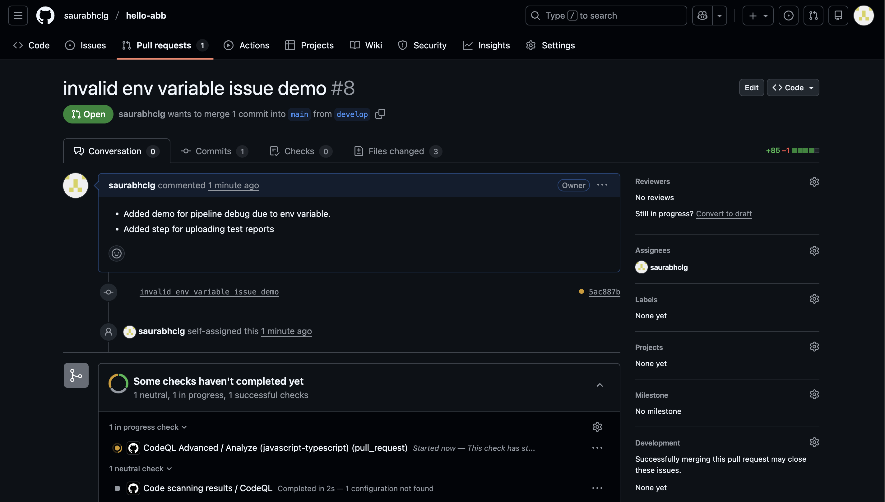
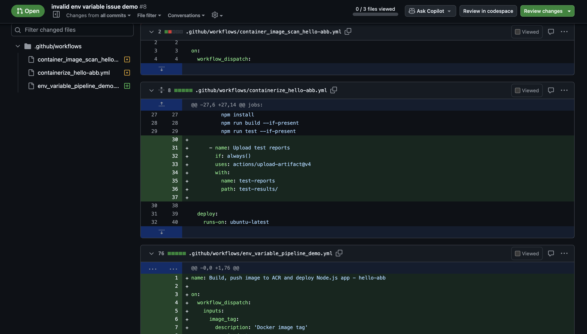
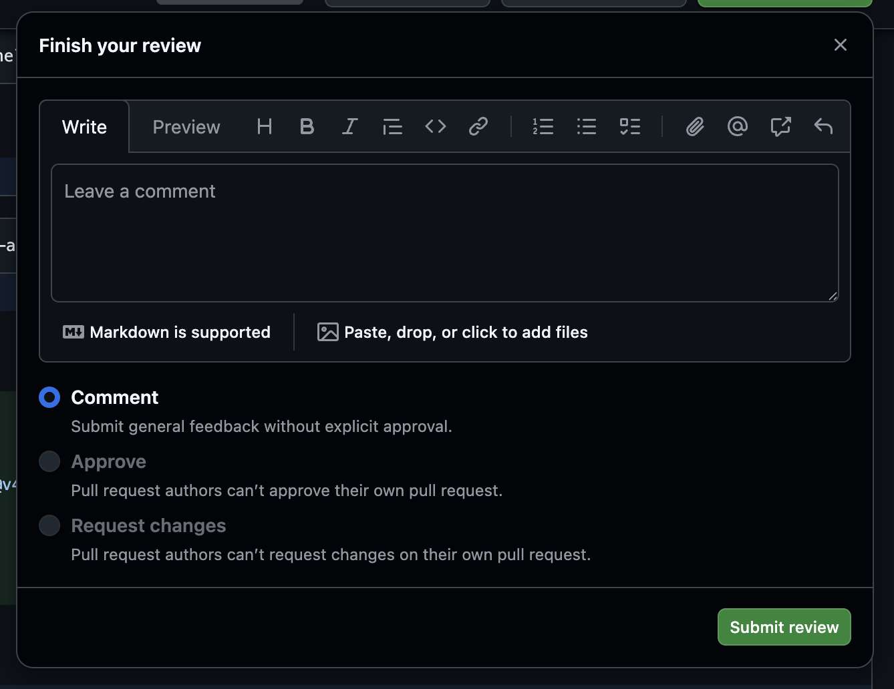
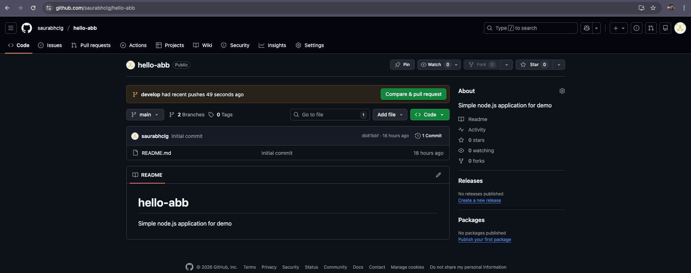

## 1. Branching and Workflow

### Branching Strategy
**Model:** GitFlow (simplified)
- `main` – production-ready code
- `develop` – integration branch
- `feature/*` – new features
- `hotfix/*` – urgent production fixes

### Workflow
1. Developer creates `feature/*` branch from `develop`
2. Code pushed → PR raised to `develop`
3. PR checks: build + unit tests
4. Code review approval required
5. Merge to `develop`
6. Release branch → merge to `main`

### PR Screen short

- 

### PR Change Log

- 

### PR Final view

- 

### Main Branch Setup
- 