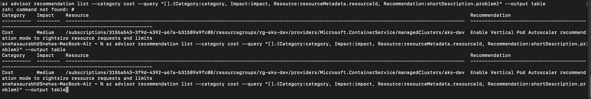

# Cost optimization — Azure Advisor

The following shows Azure Advisor cost recommendations produced with the az CLI.

### Command run:

```bash
az advisor recommendation list --category cost \
  --query "[].{Category:category, Impact:impact, Resource:resourceMetadata.resourceId, Recommendation:shortDescription.problem}" \
  --output table
```

### Recommendation (summary)

| Category | Impact | Resource | Recommendation |
|---|---:|---|---|
| Cost | Medium | `/subscriptions/315ba543-3f9d-4392-a67a-b31589a9fc08/resourcegroups/rg-aks-dev/providers/Microsoft.ContainerService/managedClusters/aks-dev` | Enable Vertical Pod Autoscaler recommendation mode to rightsize resource requests and limits |

### Notes
- Run the above command in Azure CLI to refresh recommendations.
- Apply changes in a controlled manner (test in dev) before rolling out to


### Actual terminal image
